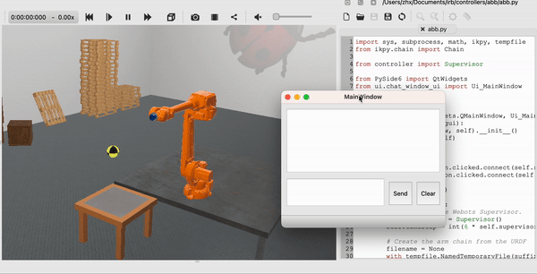

Applying Foundation Models to Develop a Cooking-Robot
=====================================================

This project aims to investigate the capabilities of foundation models in robot development. Specifically, an interesting scenario, where a learnable cooking-robot is preparing hamburgers for customer, is created. The robot is allowed to interact with those plates in different colors, representing some ingredients such as bread, lettuce, beef, cheese, and tomato. As the foundation model candidate, the ChatGPT is connected to the simulation environment. The user can input the natural language commands as prompt, then the ChatGPT should understand the user's requirements, e.g. making some hamburgers but with different recipes, and make correct task planning for the robot, using the pre-defined elementary function modules. In this way, the developer only needs to focus on those elementary function modules and prompts to the ChatGPT, the cost to the robot development can thus significantly reduce. More details please follow: <a href="https://www.microsoft.com/en-us/research/uploads/prod/2023/02/ChatGPT___Robotics.pdf" target="_blank">ChatGPT for Robotics: Design Principles and Model Abilities

File Description:
-----------------

* `requirements.txt` contains the necessary libraries.
* `worlds` contains the environment for Webots. 
* `controllers` contains a low-level function library for the manipulator and a GUI for communicating with ChatGPT.

Usage
-----

Install Webots and copy the downloaded `worlds` and `controllers` folders to the corresponding location.

```console
conda create -n env_cooking_robot python=3.9
conda activate env_cooking_robot
conda install --file requirements.txt
```

Set `Python command` in the `Preference` of your Webots to the Python path in `env_cooking_robot`.

You can follow the videos shown below to enjoy some interesting tasks.

Results
-------
[](https://www.youtube.com/watch?v=Sy_D2HqUFV4)
[](https://www.youtube.com/watch?v=DJvLcSSUI48)
<div class="half">

</div>
<div class="half">

</div>
<div class="half">

</div>

Reference
---------

<a href="https://www.microsoft.com/en-us/research/uploads/prod/2023/02/ChatGPT___Robotics.pdf" target="_blank">ChatGPT for Robotics: Design Principles and Model Abilities