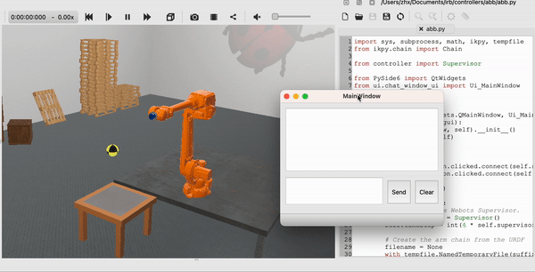

Applying Foundation Models to Develop a Cooking-Robot
=====================================================

This project aims at exploring the applications of foundation models to robot systems. The current target is to develop a learnable cooking-robot, utilizing OpenAI's ChatGPT and prompt engineering techniques. Note that, the project is still in progress and I will update the results in time.

Project Description:
--------------------

I am going to extend a trivial manipulator to a learnable cooking-robot, utilizing OpenAI's ChatGPT and prompt engineering techniques.

First, I will create a low-level function library that contains realization of basic actions such as moving and grasping for the manipulator. Then, ChatGPT is used to understand the high-level tasks from users via natural language instructions and to adapt tasks in an effective way by utilizing the low-level function library.

The project will be developed in the Webots simulator, where I will create some objects to simulate a kitchen environment.

File Description:
-----------------

* `requirements.txt` contains the necessary libraries.
* `worlds` contains the environment for Webots. 
* `controllers` contains a low-level function library for the manipulator and a GUI for communicating with ChatGPT.

Usage
-----

Install Webots and copy the downloaded `worlds` and `controllers` folders to the corresponding location.

```console
conda create -n env_cooking_robot python=3.9
conda activate env_cooking_robot
conda install --file requirements.txt
```

Set `Python command` in the `Preference` of your Webots to the Python path in `env_cooking_robot`.

You can follow the illustration shown below to enjoy some interesting tasks.

Results
-------

<center class="half">

</center>

Currently, I have create a GUI and a corresponding pipeline to communicate with ChatGPT, fetch the feedback and execute the generated code. Since I am still working on the access to OpenAI API, we can only use a "dummy" ChatGPT instead, which can only recognize the specific tasks that are hard coded as simple examples.

Reference
---------

<a href="https://www.microsoft.com/en-us/research/uploads/prod/2023/02/ChatGPT___Robotics.pdf" target="_blank">ChatGPT for Robotics: Design Principles and Model Abilities